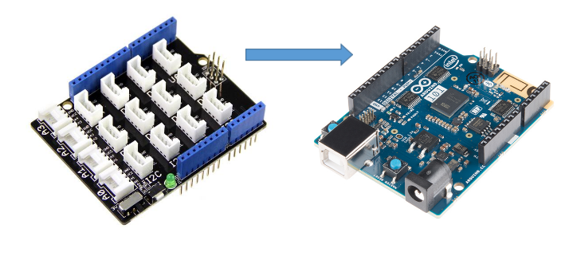
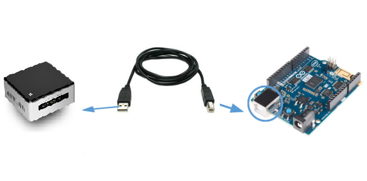
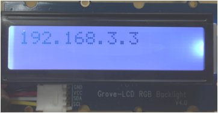
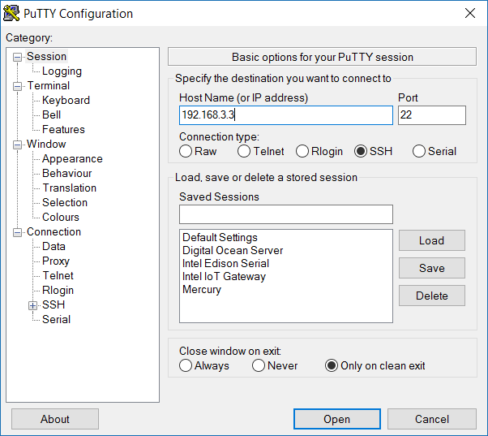

# Setup and Connect to you NUCi7 Intel* IoT Gateway

## Lab Overview and Objectives

The labs in the Intel Commercial IoT Workshop are organized in a progression that will result in each attendee building their own automated and secured, multi-device IoT network.

Start by making sure your computer, Arduino 101*, and Intel® IoT Gateway are ready for IoT development.

By the end of this module, you should be able to:

*   Unbox and setup your Intel® IoT Gateway and Arduino 101* Hardware
*   Connect to your Intel® IoT Gateway from your development computer and open a console window
*   Change the root password

## Getting Started with Grove* IoT Commercial Development Kit
The Grove* IoT Commercial Development Kit will provide you with the hardware and software to prototype and build IoT devices and  services.

It comes with a IoT gateway which is an intermediate device between sensors, actuators and your corporate network or the cloud. The gateway allows you to efficiently collect and securely transport data from devices, remote users, and applications to serve your particular IoT application.

It also comes with a starter pack of sensors. These sensors were put in the starter kit because they are commonly used in IoT projects. However, there are many other types of sensors that can be used with the Intel® IoT Gateway. The libupm sensor library current supports more than 300 types of sensors and actuators.

## Quick Arduino* 101 Introduction

The Arduino 101* board has been designed in collaboration with Intel. We are using it because it provides easily accessible GPIO pins for the sensors in the Grove* IoT Commercial Developer Kit. 

The Arduino 101* comes with the following:
*   14 digital input/output pins (four of which can be used as PWM outputs)
*   Six analog inputs
*   A USB connector for serial communication and sketch upload
*   A power jack
*   An ICSP header with SPI signals and I2C dedicated pins

## Connect Base shield to Arduino 101*

The Base shield is in the Grove* IoT Commercial Developer Kit. It uses a four pin wire to allow you to easily attach sensors to your device without a breadboard or soldering.

## Move Base Shield switch towards 5 Volts

Move Base Shield switch towards 5 Volts.

Some sensors and actuators, such as the LCD screen, will not work properly unless the base shield is set to 5V. In the case of the LCD screen the backlight will turn on with on 3.3V, but the text will not display.

## Connect LCD to Arduino 101*
Connect the LCD screen to any of the I2C pins on base shield.

### Now connect Arduino 101* with Intel® IoT Gateway via USB A-B cable.

## Connect Intel IoT gateway with Ethernet cable and Power adapter

## Press Power button to start Gateway

Press power button to start your gateway. After around 2 minutes, it will display the IP address of Gateway on the LCD. **Please, write down your IP address.*

If the IP address does not display, this is an indication that the Gateway was unable to connect to the network. Please raise your hand and contact an Intel developer about the problem.

## SSH to the Intel® IoT Gateway for Windows Users

If you are using MacOSX or Linux on your development computer you can skip to the next section.

### Download Putty

1.  Windows does not come with a built-in terminal emulator so download and use the PuTTY client.
2.  Visit the [PuTTY download page](http://www.chiark.greenend.org.uk/~sgtatham/putty/download.html).
3.  Under the "For Windows on Intel x86" heading, click on the "putty.exe" link to download the latest release version to your computer.

### Launch Putty and type in Your IP Address to connect

1.  Double-click putty.exe on your computer to launch PuTTY.
2.  Enter IP address of the Gateway
3.  You can login with the username as **nuc-user** and the password **root**.

Note that your development computer and your NUC device has to be on the same network with same subnet else it will not connect

## SSH to the Intel® IoT Gateway for Mac Users

### Open a Console and use the ssh command to connect

1.  Open Terminal
2.  Type $ ssh nuc-user@ <<ip address="">>. Replace <<ip address="">> to IP address of your gateway. E.g. nuc-user@192.168.3.3</ip></ip>
3.  Enter root as password

Note that your development computer and your NUC device has to be on the same network with same subnet else it will not connect
## Lab Conclusion

### Read about the next lab

Congratulations! You have successfully setup your Intel Iot Gateway and connected it to the Arduino 101*. In the next section, you will learn how build an IoT device from the starter kit and to develop an IoT application and deploy it to the Intel® IoT Gateway.

### Additional Resources

When you finish the lab, take a look at some of the online resources at http://software.intel.com/iot

*   [IoT Basics](https://software.intel.com/en-us/iot/journey/basics) - With the help of sensors, devices, the cloud, and your code, everyday objects or "things" can take on new abilities. Plants can let you know they need water, garage doors can be closed remotely, or drones can avoid flying into trees. The Internet of Things (IoT) is how all these objects connect together to create a smart world.
*   [Intel® IoT Gateway Technology](https://software.intel.com/en-us/iot/hardware/gateways) - the landing page for getting started with Intel® IoT Gateways
*   [What Is the Gateway and Why Should I Care?](https://software.intel.com/en-us/articles/what-is-the-gateway-and-why-should-i-care)
*   [Getting Started with Intel® IoT Gateways with the Intel® IoT Developer Kit](https://software.intel.com/en-us/getting-started-with-intel-iot-gateways-and-iotdk)
