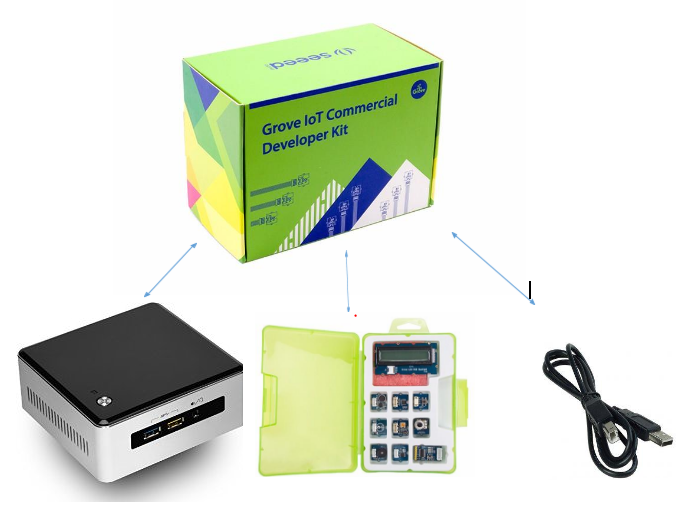
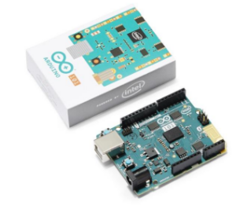
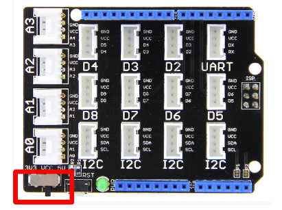
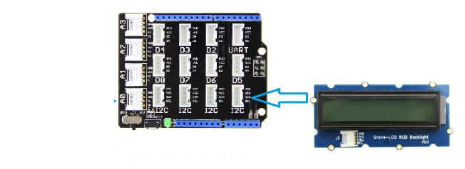
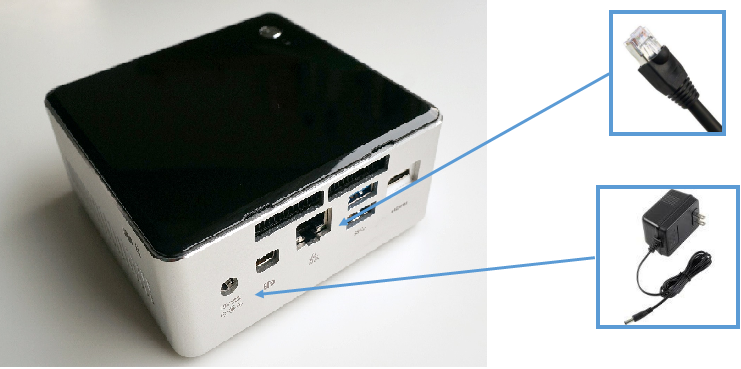
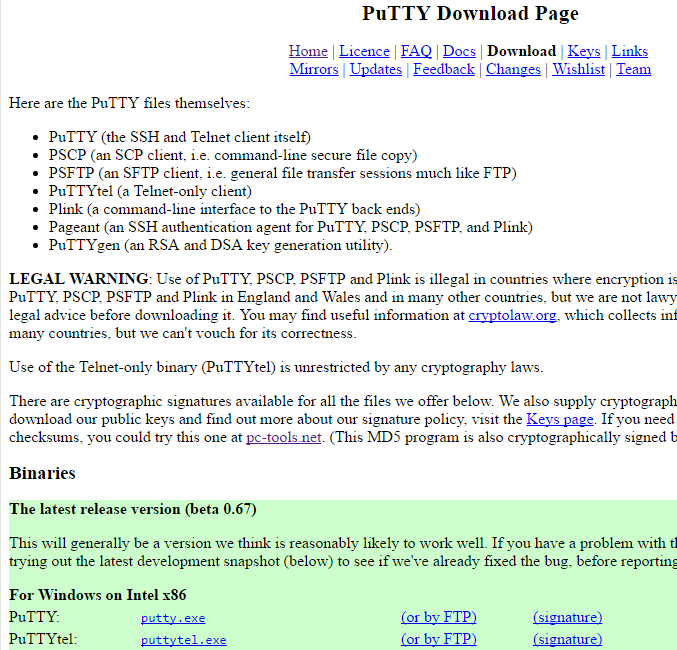
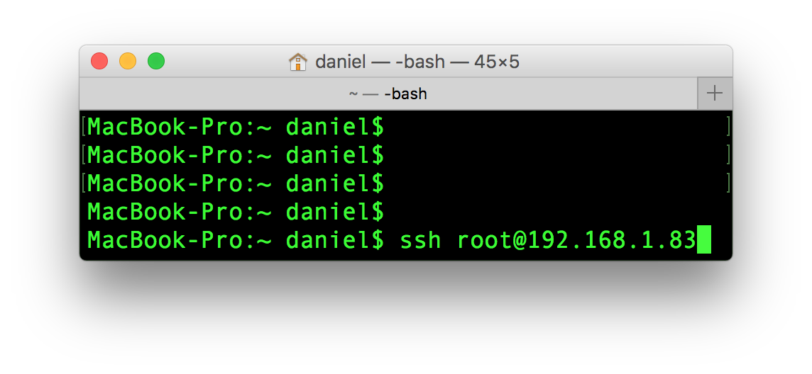

# Setup Development Environment

## Lab Overview and Objectives

The labs in the Intel Commercial IoT Workshop are organized in a progression that will result in each attendee building their own automated and secured, multi-device IoT network.

Start by making sure your computer, Arduino 101*, and Intel® IoT Gateway are ready for IoT development.

By the end of this module, you should be able to:

*   Unbox and setup your Intel® IoT Gateway and Arduino 101* Hardware
*   Connect to your Intel® IoT Gateway from your development computer and open a console window
*   Change the root password

## Getting Started with Grove* IoT Commercial Development Kit

The Grove* IoT Commercial Development Kit will provide you with a hardware and software stack to prototype and build Internet of Things services.

It comes with a IoT gateway which is an intermediate device between sensors, actuators and your corporate network or the cloud. The gateway allows you to efficiently collect and securely transport data from devices, remote users, and applications to serve your particular IoT application.

It also comes with a starter pack of sensors. These sensors were put in the starter kit because they are commonly used in IoT projects. However, there are many other types of sensors that can be used with the Intel® IoT Gateway. The libupm sensor library current supports more than 300 types of sensors and actuators.

## Connect to your Gateway's Wi-Fi Hotspot SSID

The Arduino 101* board have been designed in collaboration with Intel. We use the Arduino 101* board because it offers easily-accessible pins for IoT sensors or the Grove* IoT Commercial Developer Kit, which is described below, and simplifies connection to them—you can easily attach your sensors to the Arduino 101* board and start communicating with them. The module contains two tiny cores, an x86 (Intel® Quark™ Compute Module) and a 32-bit ARC core, both clocked at 32MHz. The Intel toolchain compiles your Arduino sketches optimally, across both cores, to accomplish the most demanding tasks.

The Arduino 101* comes with the following:

*   14 digital input/output pins (four of which can be used as PWM outputs)
*   Six analog inputs
*   A USB connector for serial communication and sketch upload
*   A power jack
*   An ICSP header with SPI signals and I2C dedicated pins

## Connect Base shield to Arduino 101*

Base shield will be included in the Grove starter kit. Attach Grove base shield with Arduino 101*.

The base shield allow you to quickly attach and detach sensors to your device without the need for a breadboard or soldering.

## Move Base Shield switch towards 5 Volts

Move Base Shield switch towards 5 Volts.

Some sensors and actuators, such as the LCD screen, will not work properly unless the base shield is set to 5V.

## Connect LCD to Arduino 101*

Connect the LCD screen to any of the I2C pins on base shield.

### Now connect Arduino 101* with Intel® IoT Gateway via USB A-B cable.

## Connect Intel IoT gateway with Ethernet cable and Power adapter

## Press Power button to start Gateway

Press power button to start gateway. After around 2 minutes, it will display the IP address of Gateway on the LCD. Note Down the IP address.

If the IP address does not display, this is an indication that the Gateway was unable to connect to the network. Please raise your hand and contact an Intel developer about the problem.

## SSH to the Intel® IoT Gateway for Windows Users

### Download Putty

1.  Windows does not come with a built-in terminal emulator so download and use the PuTTY client.
2.  Visit the [PuTTY download page](http://www.chiark.greenend.org.uk/~sgtatham/putty/download.html).
3.  Under the "For Windows on Intel x86" heading, click on the "putty.exe" link to download the latest release version to your computer.

### Launch Putty and type in Your IP Address to connect

1.  Double-click putty.exe on your computer to launch PuTTY.
2.  Enter IP address of the Gateway
3.  You can login with the username as **nuc-user** and the password **root**.

Note that your development computer and your NUC device has to be on the same network with same subnet else it will not connect

## SSH to the Intel® IoT Gateway for Mac Users

### Open a Console and use the ssh command to connect

1.  Open Terminal
2.  Type $ ssh nuc-user@ <<ip address="">>. Replace <<ip address="">> to IP address of your gateway. E.g. nuc-user@192.168.3.3</ip></ip>
3.  Enter root as password

Note that your development computer and your NUC device has to be on the same network with same subnet else it will not connect

## Change the password of your Intel® IoT Gateway

At the console type the follow:

    passwd

Follow the prompts at change your password.

## Install and configure Atom Editor

Atom is an open source text editor which we can use to write programs in our labs and then execute on the Intel® IoT Gateway

It also has an option to connect remotely to your device so that all the files on the device can be accesible through Atom UI interface on your PC/laptop

Download and install Atom for your host PC/laptop from the [atom.io](https://atom.io) link. Follow the instructions available on the link

## Install nuclide plugin in Atom

We will install version 0.226.0 of nuclide. Open a command prompt on your PC/laptop and enter following command:

    apm install nuclide@0.226.0

apm is atom package manager, in case if apm is not found, for e.g. on Windows PC set environment path variable to point to "C:\Users\{User login}\AppData\Local\atom\bin"

## Restart Atom and Rebuild Nuclide package if necessary

Close and restart Atom Editor

If you see **Nuclide** as one of the menu option in Atom then it installed successfully and you don't need the below two steps

As shown in figure if you see a red error icon on the bottom right corner, click on it and it will show that nuclide package needs rebuilding

Click on **Rebuild Packages** and once it is completed, click on **Reload Atom** which will restart Atom and you should see Nuclide in the menu

## Launch Remote connection from Nuclide

Once nuclide is installed successfully on Atom you will see Nuclide home page as shown in figure

Click on "Try it" button of **Remote Connection** on home page of Nuclide

If you don't see the home page go to menu option **Nuclide->Remote Projects->Connect to Remote Project**

## Configuration for Remote Connection to Intel® IoT Gateway

As shown in figure fill up the details for your device to connect to it remotely. You can specify your **/home/{user name}"** directory as "Initial Directory"

Give your device IP address as "Server" and your user name in "Username"

Make sure that "Authentication method" is selected as "Password:" and enter your device password there

Click on Connect

If connection is successfull you should see your device home directory in "File Tree"

## File Tree on Intel® IoT Gateway

You can browse the File Tree on the left panel of Atom Editor and it will look similar to a sample as shown in figure. Here nuc-user is the user home directory

In the next few labs you will create directories and files on Intel® IoT Gateway and you can do it remotely from your PC/laptop using Atom editor by right clicking on the parent folder and choosing **New->Folder** or **New->File**

All the changes you do here will get automatically updated on your device

## Lab Conclusion

### Read about the next lab

Congratulations! You have successfully setup your Intel Iot Gateway and connected it to the Arduino 101*. In the next section, you will learn how build an IoT device from the starter kit and to develop an IoT application and deploy it to the Intel® IoT Gateway.

### Additional Resources

When you finish the lab, take a look at some of the online resources at http://software.intel.com/iot

*   [IoT Basics](https://software.intel.com/en-us/iot/journey/basics) - With the help of sensors, devices, the cloud, and your code, everyday objects or "things" can take on new abilities. Plants can let you know they need water, garage doors can be closed remotely, or drones can avoid flying into trees. The Internet of Things (IoT) is how all these objects connect together to create a smart world.
*   [Intel® IoT Gateway Technology](https://software.intel.com/en-us/iot/hardware/gateways) - the landing page for getting started with Intel® IoT Gateways
*   [What Is the Gateway and Why Should I Care?](https://software.intel.com/en-us/articles/what-is-the-gateway-and-why-should-i-care)
*   [Getting Started with Intel® IoT Gateways with the Intel® IoT Developer Kit](https://software.intel.com/en-us/getting-started-with-intel-iot-gateways-and-iotdk)
