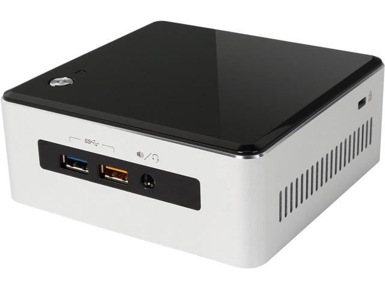

# Intel Industrial IoT Workshop Setup Guide
This guide will walk you through the hardware and software setup for this workshop.

Intel offers scalable hardware solutions at different power, performance and price points. During these labs we will be using two different products that have Intel hardware.

## Up2 Board
First is the [Up2 Board](http://www.up-board.org/upsquared/). It features a 40 Pin I/O connector, multiple USB 3.0 ports, double Gigabit Ethernet, HDMI and more other features make it a perfect solution for different domains and products like Robotics, Drone, Machine Vision, Smart Home, Education, Digital Signage, Intelligent Cars, Internet Of Things. The compatibility with Linux, Android, and all the Windows 10 distributions give you great flexibility, scalability and quick time to market.

### Next Steps
- [ ] [Setup the Up2 Board Hardware](./setup-hardware-up2.md)
- [ ] [Setup the Arduino Create Development Environment](./setup-arduino-up2.md)

## NUC Core i7
 The second is a [NUC Core i7](https://www.intel.com/content/www/us/en/products/boards-kits/nuc/kits/nuc5i5ryh.html) with powerful performance in a small package. This NUC will be used to power machine learning, computer vision and large dataset jobs anywhere in your network.

 ### Next Steps
 - [ ] [Setup NUC Hardware](./setup-hardware-nuci7.md)
 - [ ] [Setup Arduino Create Development Environment](./setup-arduino-nuci7.md)
